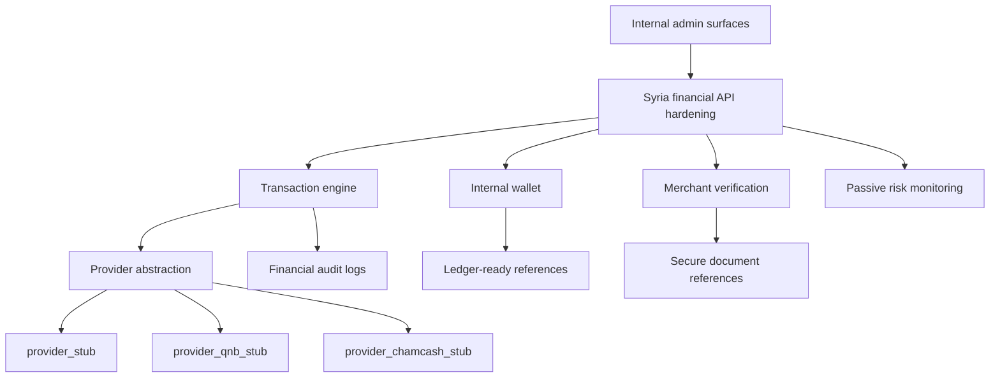

# Syria Financial Architecture

This document describes the non-live SYBNB Syria financial foundation. It prepares future integrations with Cham Cash, QNB Syria, Mastercard rails, bank transfers, and future Syrian providers without activating real payments.

## Architecture

## Module boundaries

All code lives in `services/payment-service/src/syria-financial` and is isolated from `apps/web`.

- `transactions`: statuses, idempotency key, audit trail, provider-agnostic state transitions.
- `wallet`: available, pending, payout, refund, and hold balances with immutable references.
- `payouts`: payout preparation only.
- `providers`: stub-only provider contracts.
- `audit`: immutable, redacted financial audit records.
- `events`: provider event normalization.
- `merchant-verification`: merchant, KYC, identity, bank account, approval, rejection, and document reference structures.
- `risk`: passive duplicate, velocity, IP, failure, and provider anomaly signals.
- `admin`: internal dashboard data structures.
- `api`: correlation IDs, idempotency, rate-limit context, validation, and safe error responses.

## Feature flags

All are off by default:

- `FEATURE_SYRIA_WALLET`
- `FEATURE_SYRIA_PAYOUTS`
- `FEATURE_SYRIA_KYC`
- `FEATURE_SYRIA_PROVIDER_QNB`
- `FEATURE_SYRIA_PROVIDER_CHAMCASH`
- `FEATURE_SYRIA_RISK_ENGINE`

## Database namespace

Prisma models use the `Syria*` model prefix and map to `syria_*` tables. Additive schema changes avoid rewriting booking logic and preserve existing payment-service models.

## Operational limitations

- No route is mounted for Syria financial execution.
- No live provider credentials are required.
- No real balances are public.
- No payout instruction leaves the service.
- No Stripe live mode is introduced.
