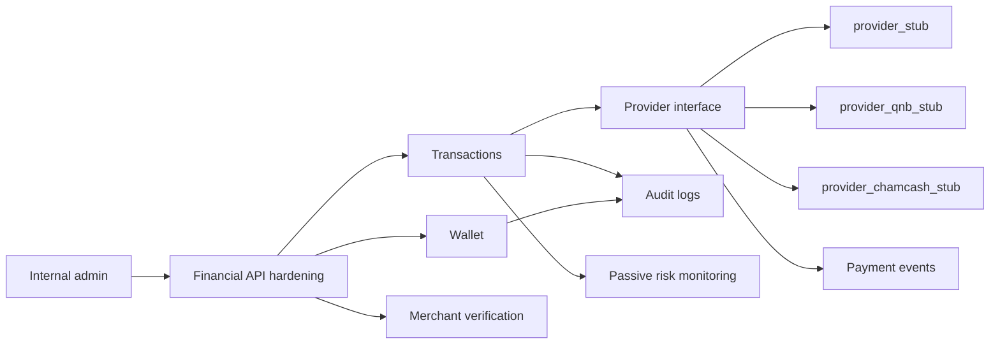

# Syria Financial Architecture

SYBNB now has an architecture-only Syria financial namespace in `services/payment-service/src/syria-financial`.

## Boundaries

- The financial foundation lives in `services/payment-service`; no `apps/web` route or page was changed.
- All database models use the `syria_financial_` table prefix and string references to booking, payer, and merchant IDs.
- No live payment provider is registered, no deployment is triggered, and no real money movement exists.

## Modules

- `wallet`: internal balances and immutable ledger references.
- `transactions`: provider-agnostic transaction lifecycle.
- `payouts`: payout planning only, feature-flag protected.
- `providers`: disabled stubs for QNB Syria, Cham Cash, and a generic provider.
- `audit`: immutable audit event contracts.
- `payment-events`: provider event normalization.
- `merchant-verification`: KYC and document-reference workflow.
- `risk-monitoring`: passive fraud signals.
- `admin`: internal dashboard contracts only.
- `api`: correlation, idempotency, rate-limit, and error helpers.

## Limitations

- This is not a licensed payment system.
- This does not prove bank connectivity, settlement capability, card acquiring, or regulatory approval.
- Production use requires legal, compliance, banking, reconciliation, and security reviews.
