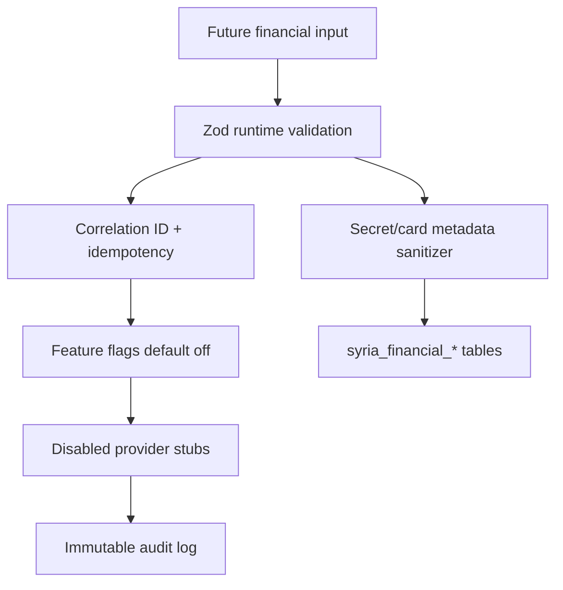

# Syria Financial Security Model

The Syria financial foundation is designed for preview-safe preparation only.

## Controls

- Runtime validation uses Zod schemas.
- Feature flags default off for wallet, payouts, KYC, QNB, Cham Cash, risk, and admin dashboard.
- Provider stubs return `executed=false` and `liveMode=false`.
- Financial metadata rejects raw card fields and redacts secret-like keys.
- Error responses avoid stack traces and expose correlation IDs for investigation.
- Risk signals are passive only and do not block users.

## Operational limitations

- No live payment provider is connected.
- No Stripe live mode is enabled by this work.
- No public financial API route is registered.
- No migration is deployed.
- No production financial operation is safe without compliance, bank, security, and reconciliation work.
