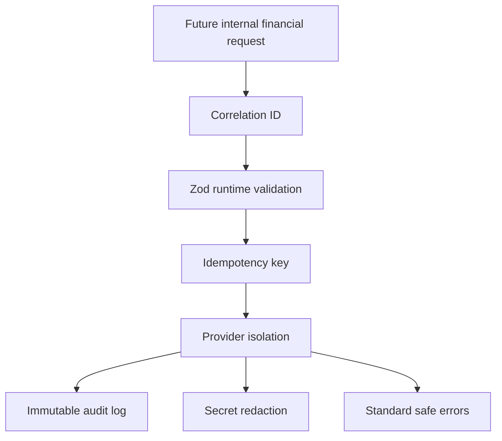

# Syria Financial Security Model

The Syria financial foundation is designed for preview safety and future compliance hardening.

## Controls

## Security assumptions

- All Syria financial APIs remain internal until explicit production approval.
- Feature flags default off.
- Provider adapters are stubs and cannot move money.
- Raw card data and full banking secrets are rejected or redacted.
- Error responses avoid stack traces.
- Audit logs include actor, timestamp, target, and request correlation ID.

## Risk and fraud foundation

The risk layer is passive only. It prepares duplicate payment, velocity, suspicious IP, repeated failure, and provider anomaly signals without blocking users.

## Operational limitations

- No real payment execution.
- No real payout execution.
- No live provider connectivity.
- No production financial operations.
- No public balance exposure.

## Future hardening

- Add a durable rate limiter before mounting any financial route.
- Add provider-specific webhook signature verification.
- Add encrypted document and bank reference storage.
- Add AML/sanctions screening and legal approval gates.
- Add immutable hash chaining for audit-log persistence.
