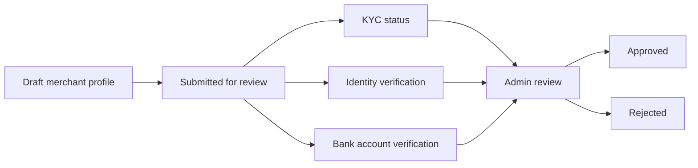

# Syria KYC and Compliance Foundation

The merchant verification foundation prepares review workflows without storing or exposing sensitive documents.

## Workflow

## Supported structures

- Merchant profile.
- KYC status.
- Identity verification status.
- Bank account verification status.
- Approval and rejection workflow.
- Document references with `exposedPublicly: false`.
- Admin-review metadata through audit logs.

## Security assumptions

- Documents are stored through a secure storage abstraction.
- The application stores references, not raw document bodies.
- Public routes must never return document references without a separate authorization layer.
- Admin decisions must generate financial audit logs.

## Compliance warnings

- This is not a complete KYC/AML program.
- Sanctions screening, beneficial ownership, watchlist checks, licensing review, and retention policy are not implemented.
- Future production use requires jurisdiction-specific legal and banking approval.
