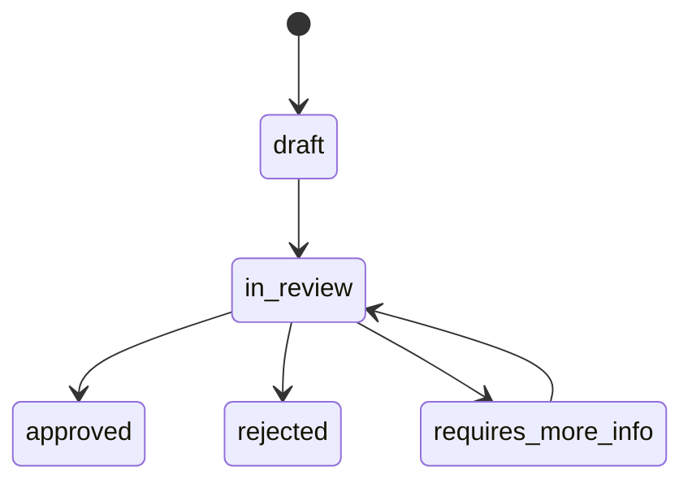

# Syria KYC and Compliance Foundation

The merchant verification layer prepares data structures for admin-reviewed KYC without making compliance claims.

## Merchant profile fields

- Merchant profile ID and merchant ID.
- Country code fixed to `SY`.
- KYC status.
- Identity verification status.
- Bank-account verification status.
- Approval workflow status.
- Secure document references.

## Document safety

- Document records store `storageRef` and optional checksum only.
- `exposedPublicly` is always false in runtime schemas.
- Raw identity documents are not exposed through this foundation.

## Compliance warnings

- This code does not perform sanctions screening.
- This code does not perform identity verification.
- This code does not validate bank ownership.
- This code does not approve merchants automatically.
- Future production use requires Syrian legal review, provider terms review, data-retention policy, and admin audit controls.
