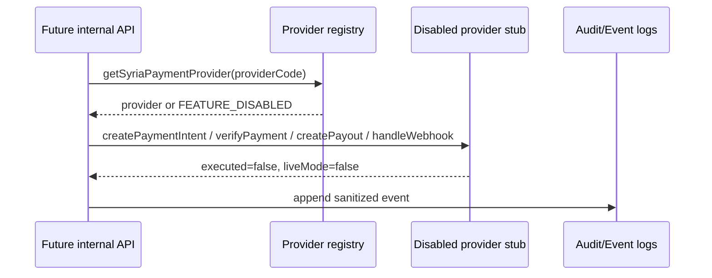

# Syria Payment Provider Readiness

The provider layer defines a common interface for future Syrian payment rails without activating any rail.

## Supported contracts

Every provider must implement:

- `createPaymentIntent`
- `verifyPayment`
- `createPayout`
- `handleWebhook`
- `healthCheck`

## Current providers

- `provider_stub`: local validation-only stub.
- `provider_qnb_stub`: QNB Syria contract placeholder, disabled by `FEATURE_SYRIA_PROVIDER_QNB=false`.
- `provider_chamcash_stub`: Cham Cash contract placeholder, disabled by `FEATURE_SYRIA_PROVIDER_CHAMCASH=false`.

## Security assumptions

- No provider stores secrets.
- No provider connects to bank, card, or wallet networks.
- No card entry, raw PAN, CVV, account number, or authorization token is accepted.
- All results report `executed=false` and `liveMode=false`.

## Future integration points

- Provider credentials must be stored in a secrets manager, not source code.
- Webhook verification must use provider-specific signatures.
- Idempotency keys must be persisted before execution.
- Reconciliation, refund, chargeback, and settlement reporting need separate operational controls.
