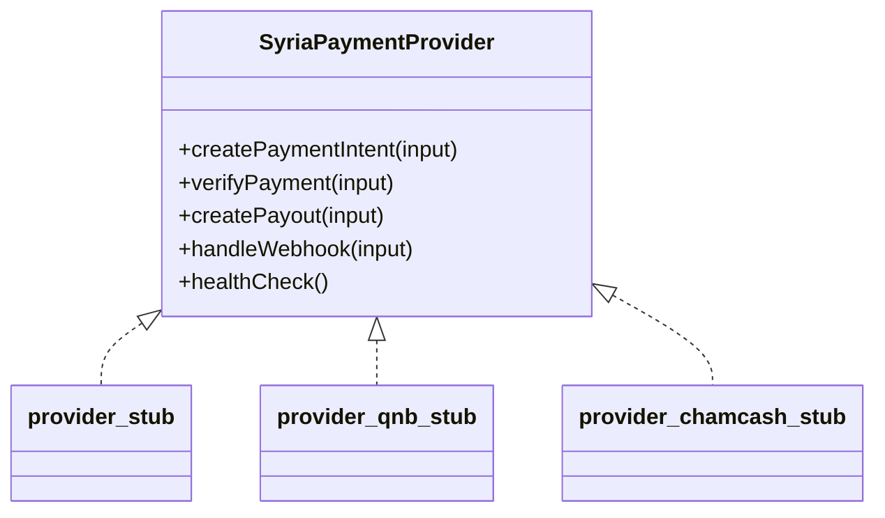

# Syria Payment Provider Readiness

The provider layer is ready for future adapter work but currently allows only stub behavior.

## Provider abstraction

## Current providers

- `provider_stub`: generic non-live provider.
- `provider_qnb_stub`: QNB Syria placeholder behind `FEATURE_SYRIA_PROVIDER_QNB`.
- `provider_chamcash_stub`: Cham Cash placeholder behind `FEATURE_SYRIA_PROVIDER_CHAMCASH`.

Each provider validates input and returns `livePaymentExecuted: false`.

## Future integration points

- Cham Cash intent creation and verification.
- QNB Syria authorization, settlement, and payout APIs.
- Mastercard rail integration through a licensed processor.
- Bank transfer reconciliation and payout files.
- Future Syrian provider adapters that implement the same interface.

## Compliance warnings

- Do not add live credentials until legal, banking, licensing, AML, sanctions, and PCI requirements are approved.
- Do not store raw card data or full bank account numbers.
- Do not expose provider failure details publicly.
- Do not bypass idempotency and audit logging when replacing stubs.

## Readiness level

Provider abstraction is structurally ready. Banking connectivity is not ready and remains intentionally disabled.
