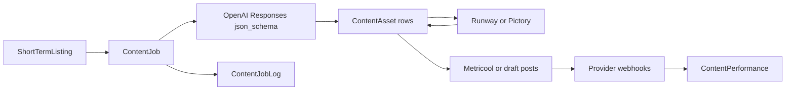

# LECIPM — Full social content automation

End-to-end pipeline: **BNHUB listing → structured social copy (5 styles, validated) → optional vertical video → Metricool schedule / draft / direct publish stubs → performance snapshots → job logs**.

## Architecture



### Database (Prisma)

| Table | Purpose |
|-------|---------|
| `content_jobs` | Status lifecycle, `platform_target`, `content_style`, `approval_required`, **`approval_mode`**, `last_copy_provider`, `last_video_provider` |
| `content_assets` | `SCRIPT`, `CAPTION`, `HASHTAG_SET`, **`OVERLAY_TEXT`**, **`CTA`**, `VIDEO`, `THUMBNAIL`, **`METADATA`** |
| `social_posts` | Per-platform draft / scheduled / published |
| `content_performance` | Time-series metrics |
| **`content_job_logs`** | Append-only pipeline / provider events |

Apply migrations after pulling:

```bash
cd apps/web && pnpm prisma migrate deploy
```

### Config (env)

| Variable | Purpose |
|----------|---------|
| `CONTENT_AUTOMATION_APPROVAL_MODE` | `manual` (default) · `auto_schedule` · `auto_publish` |
| `CONTENT_AUTOMATION_DEFAULT_PLATFORMS` | Comma list `tiktok`, `instagram` → maps to `TIKTOK` / `INSTAGRAM` / `BOTH` |
| `OPENAI_API_KEY` | Structured copy |
| `RUNWAY_API_KEY`, `PICTORY_API_KEY` | Video |
| `METRICOOL_API_TOKEN`, `METRICOOL_BLOG_ID` | Scheduling |
| `TIKTOK_CLIENT_ID`, `TIKTOK_CLIENT_SECRET` | TikTok Content Posting API |
| `META_APP_ID`, `META_APP_SECRET`, `INSTAGRAM_ACCESS_TOKEN`, `INSTAGRAM_BUSINESS_ACCOUNT_ID` | Instagram Graph |
| `CONTENT_AUTOMATION_WEBHOOK_SECRET` | Provider webhooks (`x-webhook-secret`) |
| `CRON_SECRET` | Worker auth for `POST /api/content-automation/run` |

### Approval modes

- **`manual`**: Pipeline stops at `READY`; admins schedule/publish from dashboard or APIs.
- **`auto_schedule`**: After `READY`, if listing is **PUBLISHED** and Metricool credentials work, attempts Metricool handoff (otherwise logs + draft rows).
- **`auto_publish`**: Attempts direct TikTok/Instagram (stubs until OAuth + app review).

Host-triggered jobs (`POST /api/bnhub/listings/[id]/content-jobs`) never bypass listing **published** checks for outbound actions.

### Safety / rules

- `lib/content-automation/validators.ts` — title, city, images, published schedule gate.
- `lib/content-automation/rules.ts` — auto schedule/publish gates.
- `lib/content-automation/generate-content-pack.ts` — each pack has `valid`, `invalidReason`, `safetyChecks`, `requiredFieldsUsed`; **no price-based price_shock** when nightly price is missing (pack marked invalid, no fabricated numbers).
- **&lt; 3 images**: video step skipped; logged.

### API routes

| Route | Role |
|-------|------|
| `POST /api/content-automation/run` | Admin or `x-cron-secret` — `{ listingId }` or `{ jobId }` |
| `GET /api/content-automation/jobs` | Admin — query `listingId`, `status`, `platform`, `take` |
| `GET /api/content-automation/jobs/[id]` | Admin — full job + assets + posts + logs |
| `POST /api/content-automation/retry` | Admin — body `{ jobId, skipVideo? }` |
| `POST /api/content-automation/schedule` | Admin — body `{ jobId, scheduledAt?, platforms?, captionAssetId? }` |
| `POST /api/content-automation/publish/direct` | Admin — body `{ jobId, platform: tiktok \| instagram, mode? }` |
| `POST /api/content-automation/jobs/[jobId]/retry` | Deprecated alias → use `/retry` |
| `POST /api/content-automation/jobs/[jobId]/schedule` | Deprecated alias → use `/schedule` |
| `POST /api/bnhub/listings/[id]/content-jobs` | Owner or admin |
| `POST /api/content-automation/webhooks/*` | Webhook secret |

### Admin UI

- **Growth automation (jobs):** `/admin/content`
- **Job detail:** `/admin/content/[jobId]`
- **Legacy i18n generated content:** `/admin/content/generated`

Host: `/bnhub/host/listings/[id]/edit` — generate content + **copy share link (UTM)**.

### Attribution

`lib/content-automation/attribution.ts` — `utm_campaign=listing_[listingId]`, optional `utm_content=[style]_[jobId]`.

### Failure handling

- `ContentJobLog` records validation, provider errors, skips.
- Retry via UI or `POST /api/content-automation/retry`.

### Overlap with `content_generated`

Older BNHUB `content_generated` rows may still exist. Prefer **`content_jobs` / `content_assets`** for the full pipeline.

---

## Phase 19 — Deliverable summary

### DB models / tables added or extended

- `content_jobs` — extended with `approval_mode`, `last_copy_provider`, `last_video_provider`
- `content_assets` — extended enum: `OVERLAY_TEXT`, `CTA`, `METADATA`
- `content_job_logs` (new)
- `social_posts` — extra indexes (`platform`, `scheduled_at`, `published_at`)

### Routes added

- `GET /api/content-automation/jobs`, `GET /api/content-automation/jobs/[id]`
- `POST /api/content-automation/retry`, `POST /api/content-automation/schedule`, `POST /api/content-automation/publish/direct`
- (Existing) `POST /api/content-automation/run`, webhooks, `POST /api/bnhub/listings/[id]/content-jobs`

### Service / lib files

- `config.ts`, `rules.ts`, `run-job.ts`, `retry-job.ts`, `job-state-machine.ts`, `job-log.ts`
- `schedule-content-job.ts`, `publish-direct-job.ts`
- `generate-content-pack.ts` (structured outputs + validation fields)
- `validators.ts`, `select-listing-media.ts`, `attribution.ts`, `sync-performance.ts`, providers, `dao.ts`

### Dashboard pages

- `/admin/content` — job list (filters: status, platform)
- `/admin/content/[jobId]` — detail, logs, actions
- `/admin/content/generated` — previous “Generated content” i18n table

### Provider integrations — live-ready vs pending

| Area | Status |
|------|--------|
| OpenAI structured packs | **Ready** with deterministic fallback |
| Runway / Pictory HTTP | **Stub URLs** — replace with your provider contracts |
| Metricool | **Stub** — wire real workspace API |
| TikTok / Instagram direct | **Stub** — requires OAuth tokens + app audit |
| Webhooks | **Ready** (secret-gated) — adapt payloads to provider docs |

### QA checklist

1. `pnpm prisma migrate deploy` — new columns/tables apply.
2. Host `POST /api/bnhub/listings/{id}/content-jobs` → job `READY`, assets include `METADATA` + per-style rows.
3. `/admin/content/[jobId]` shows logs and invalid `price_shock` when price missing.
4. `POST .../schedule` creates scheduled or draft `social_posts` with clear warnings if Metricool missing.
5. `POST .../publish/direct` records attempts and logs stub errors until APIs are wired.
