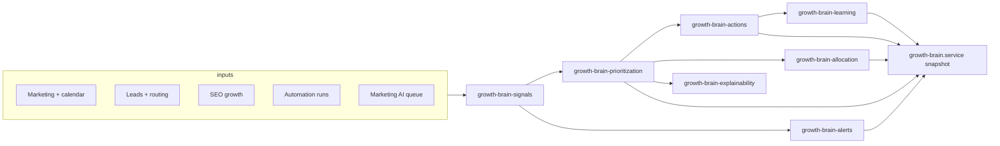

# Growth AI Brain (LECIPM)

**Location:** `apps/web/modules/growth-brain/`  
**Admin UI:** `/dashboard/admin/growth-brain` (locale-prefixed)  
**Mobile:** `/api/mobile/admin/growth-brain/summary|opportunities|alerts`

## Purpose

Central **decision-support** layer that ingests cross-product growth signals, ranks opportunities, proposes **bounded** actions, explains every recommendation, and logs outcomes. It is **not** an autonomous spender: there is **no uncontrolled financial execution** and **no uncontrolled mass messaging**. Impactful or revenue-sensitive moves stay **approval-gated** and **reversible** (policy-level routing/content changes, not irreversible monetary commits inside this module).

## Architecture

## Signal model

Each `NormalizedSignal` includes `signalType`, `domain`, `severity`, `confidence`, `expectedImpact`, and `sourceData` (numbers/strings for audit). Signals are produced in `growth-brain-signals.service.ts` by combining:

- Growth leads funnel stats  
- Marketing content performance  
- SEO sessions vs leads  
- Automation + marketing AI queue depth  
- Synthetic **monitoring** signals when live data is sparse (low confidence, still labeled)

## Prioritization logic

Weighted score over **revenue upside**, **urgency** (from severity), **confidence**, **ease of execution**, and **strategic fit** (hub weights in `growth-brain.config.ts`). Opportunities use stable ids `opp-{signalId}` so downstream actions and approvals can align across runs.

## Action model

`GrowthAction` includes `riskLevel`, `autoExecutable`, and `approvalRequired`.  
Rules skew toward:

- **ASSIST:** suggestions only  
- **SAFE_AUTOPILOT:** only low-risk automations (e.g. draft queue, training assignment) when scores allow  
- **APPROVAL_REQUIRED / default high-impact:** campaigns, routing policy shifts, revenue-impacting flows  

## Autonomy rules

| Mode | Behavior |
|------|------------|
| OFF | Read-only suggestions (implementation respects UI autonomy storage) |
| ASSIST | Recommendations only |
| SAFE_AUTOPILOT | Emit safe auto flags on selected low-risk actions |
| APPROVAL_REQUIRED | Force approval paths for sensitive classes |

## Explainability rules

`growth-brain-explainability.service.ts` must output **which signals**, **why ranked**, **target metric**, **confidence tier**, and **why approval is required or not**. No silent scoring.

## Approval model

Approval queue ids are stable: `apr-{opportunityId}-{actionType}`. Prior decisions are preserved when refreshing snapshots unless a new pending row replaces an open pending item.

## Admin workflow

1. Open **Growth AI Brain** dashboard.  
2. Review **Opportunity board** and **Explainability** card.  
3. Adjust **Autonomy** mode.  
4. Execute safe-lane ideas in marketing/CRM manually or via linked hubs.  
5. Process **Approval queue** for gated items.  
6. Log outcomes (future: wire `logActionOutcome` to CRM/revenue events) to fuel **Learned patterns**.

## Tests

See `apps/web/modules/growth-brain/__tests__/growth-brain.test.ts`.
