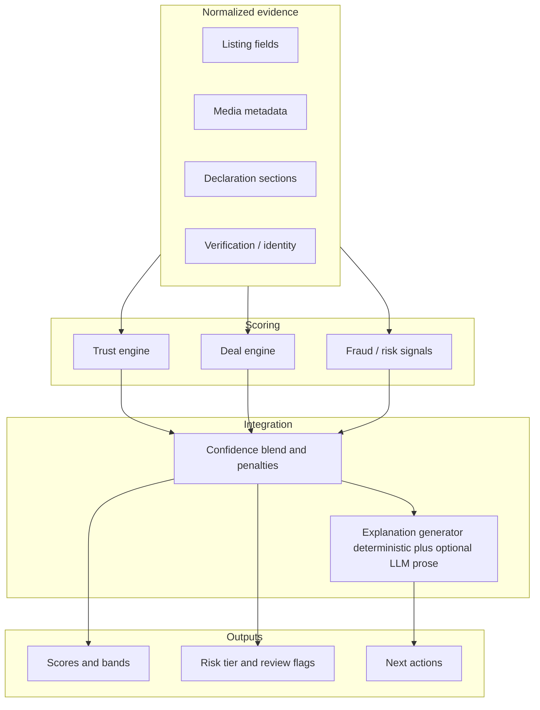

# Core brain architecture (technical overview)

**Audience:** Engineering and patent counsel briefing. **Not** a marketing document.

## Design intent

The system is framed as a **structured decision pipeline**, not an opaque “AI score.” Numeric outputs are accompanied by **confidence**, **issue codes**, and **human-review flags** where appropriate.

## Layered view

## Fraud / evidence graph (conceptual)

Deterministic relationships (e.g. shared media hashes across listings, owner cluster hints) feed **fraud families**, which aggregate to a **fraud score** and **risk level**. Escalation to human review is explicit; automated enforcement is out of scope for this document.

## UI contract (seller-facing)

- **Trust** and **deal** headline numbers are shown with **separate confidence**.
- **Risk** uses a compact tier (e.g. low / medium / high) with **codes**, not raw internal signals.
- **Next actions** map issue codes to concrete steps (e.g. add exterior photo, complete declaration).

## Internal validation

Runs store `predicted_*` vs `human_label` per entity and dimension; metrics include agreement rate and targeted false-positive views (e.g. “strong opportunity” vs human “avoid”).

---

_This description is implementation-agnostic where possible; align with actual code and versioned thresholds in `SCORING_FORMULAS_AND_THRESHOLDS.md`._
