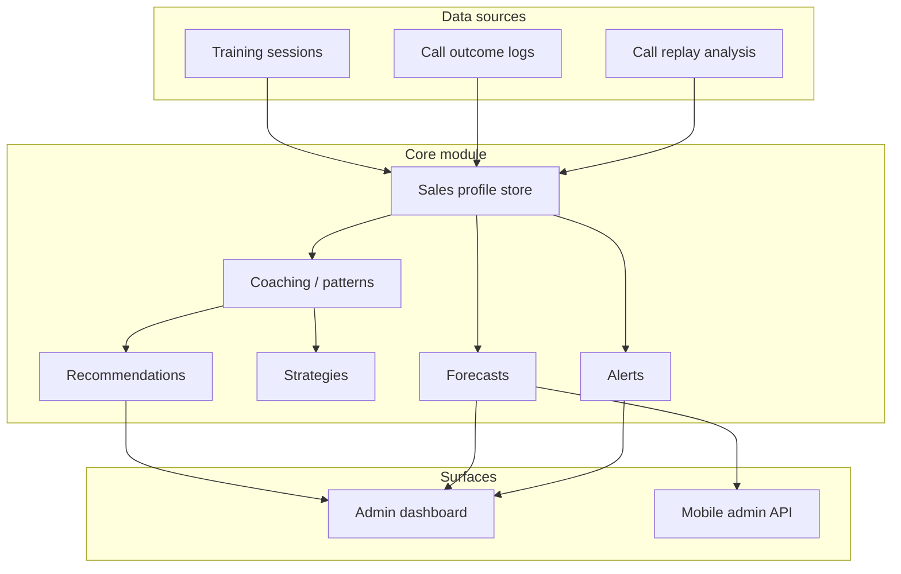

# AI Sales Manager (LECIPM)

## Purpose

The **AI Sales Manager** is a **coaching and management intelligence layer** on top of:

- Training Hub (scenario catalog + team training sessions)
- Live Call Assistant / Call Center (human-spoken only)
- Sales psychology detection
- Negotiation / closer coaching patterns
- Team training (sessions, challenges, leaderboards)
- Call Replay Analyzer (transcript + heuristic review)

It is **not** an autonomous dialer, not an auto-caller, and does not auto-speak to clients. Managers and reps stay in control; all machine output is **explainable** (rules, triggers, and stated data sources).

## System architecture

**Code location:** `apps/web/modules/ai-sales-manager/`

**Persistence (current):** browser `localStorage` (and in-memory on the server) under key `lecipm-ai-sales-manager-v1`, same family as team training and call replay. For production, point the same services at your CRM / data warehouse; the types and service boundaries are designed to swap storage without changing UI logic.

## Inputs and outputs

| Input | Service |
|--------|---------|
| Team training session results | `syncAiSalesProfilesFromTrainingSession` (hooked from `completeSessionResults`) |
| Logged call outcome (demo, control, close, objections) | `updateSalesProfileFromCall` |
| Lab result | `updateSalesProfileFromTraining` |
| Call replay analysis | `ingestCallReplayAnalysisForUser` |

| Output | Description |
|--------|-------------|
| `CoachingRecommendation` | Title, reason, **triggers** (data that fired the rule), scenario IDs, urgency |
| `StrategySuggestion` | Title, explanation, when to use, example line (for the human to say) |
| `PerformanceForecast` | Current / best-case / if-coaching-followed bands with **confidence** and **risk factors** |
| `SalesAlert` | Manager notification with deduplication window |
| `OverallSalesScore` | Weighted score + per-factor contribution and plain-language explanation |

## Scoring logic (high level)

`computeOverallSalesScore` blends:

- **Training lab** average (28%)
- **Control** (22%)
- **Closing** mechanics (22%)
- **Outcomes** — win rate and demo rate from logs (18%)
- **Trend** from rolling `scoreHistory` (10%)

**Confidence** rises with more calls and more training sessions (capped). Thin data → lower confidence surfaced to managers and mobile API.

## Recommendation logic

`generateCoachingRecommendations`:

1. Runs `analyzeCoachingSignals` on the profile (weak demo rate, weak personality axis, repeated objections, replay flags, etc.).
2. Maps gaps to **`TRAINING_SCENARIOS`** IDs (broker/investor, difficulty, persona).
3. Every item includes **`triggers`** (`ExplainableTrigger[]`) so managers can audit “why this fired.”

## Forecasting logic

`forecastPerformance`:

- Starts from **observed** demo/book rate and close rate.
- Applies **conservative** confidence from sample size.
- **Best case** adds a small uplift band with explicit optimistic assumptions.
- **If coaching followed** uses the count of prioritized weakness areas to estimate a **small** uplift — intentionally **not** overconfident.

## Strategy logic

`generateStrategySuggestions` produces tactical guidance (short openings, control questions, objection pre-brief, binary close) driven by aggregated metrics and top objections — again with **example lines for the rep**, not outbound automation.

## Manager workflow

1. Open **Admin → AI Sales Manager** (`/dashboard/admin/ai-sales-manager`).
2. Review **Team overview**, **Alerts**, and **Needs support**.
3. Drill into a rep; read **score breakdown**, **recommendations**, **forecast**, **precall brief** (for live assist), and **manager notes**.
4. Use **Team training** to log sessions — profiles update automatically via `completeSessionResults`.
5. Optionally ingest **call replay** analysis per rep with `ingestCallReplayAnalysisForUser`.

## Mobile API

- `GET /api/mobile/admin/ai-sales-manager/summary` — org rollup; optional `?teamId=` for team slice (ADMIN JWT).
- `GET /api/mobile/admin/ai-sales-manager/user/[id]` — lightweight salesperson card (ADMIN JWT).

Server-side responses may show **empty** profiles until backend sync is wired; the JSON includes a short **disclaimer**.

## Ethics and compliance

- No auto-dialing; no AI voice speaking to prospects from this module.
- Outputs are **audit-friendly**: triggers, narratives, and conservative confidence.
- Managers approve assignments and coaching actions.
